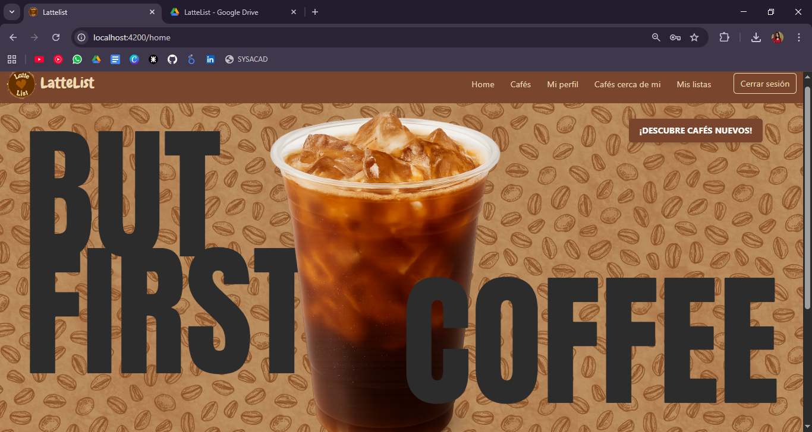
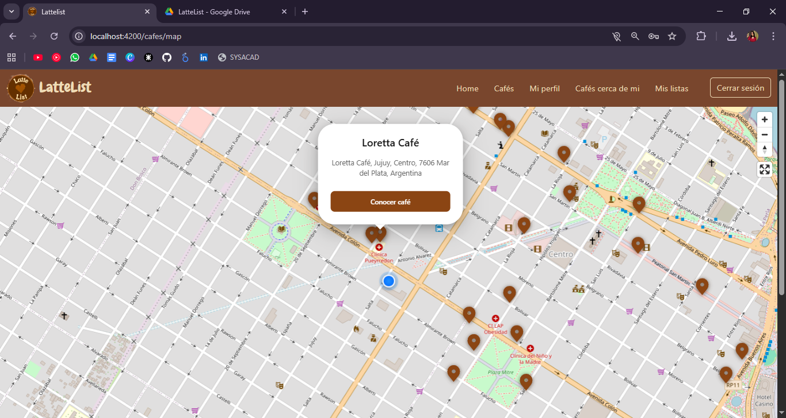
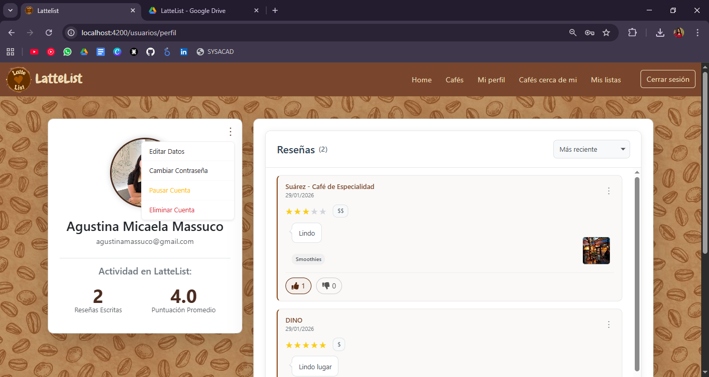
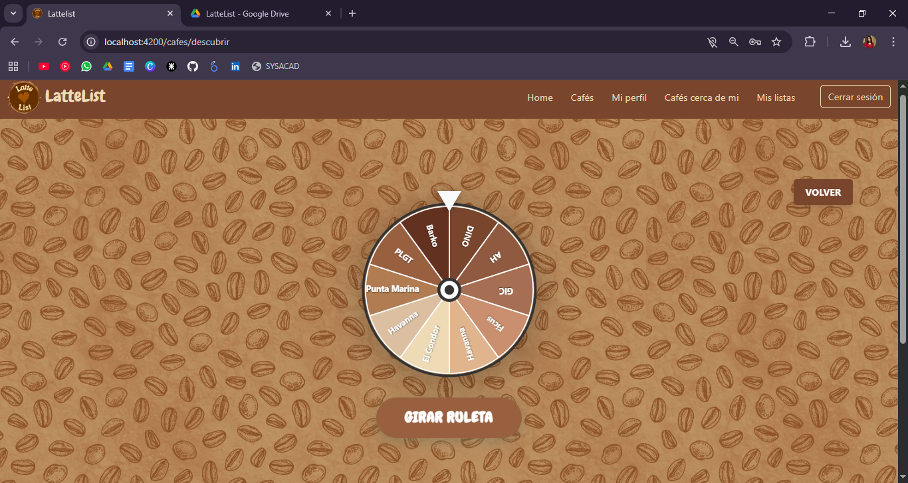

# ☕ LatteList - Frontend Application


Interfaz de usuario para **LatteList**, una Single Page Application (SPA) reactiva y moderna diseñada para la comunidad cafetera de Mar del Plata.

**Demo en vivo:** [https://latte-list.vercel.app](https://latte-list.vercel.app)

## Características Destacadas
* **Mapa Interactivo:** Integración con MapLibre GL para geolocalización de cafés.
* **Estado Reactivo:** Uso de **Angular Signals** para una gestión de estado eficiente.
* **Diseño Responsivo:** Maquetación con Bootstrap 5 adaptable a móviles y tablets.
* **Animaciones:** Experiencia dinámica mediante SVGs animados.


## Stack Tecnológico

- **Framework:** Angular 20 (Arquitectura Standalone)
- **Lenguaje:** TypeScript
- **Compilador:** esbuild 
- **Estilos:** Bootstrap 5 + CSS3 + Animate.css
- **Iconos:** Bootstrap Icons
- **Mapas:** MapLibre GL
- **Estado y asincronía:** RxJS + Angular Signals
- **Comunicación:** HttpClient (API REST)


## Seguridad

El acceso está protegido mediante lógica avanzada en el cliente:
- **Guards funcionales:** `authGuard`, `adminGuard` y `clientGuard`.
- **Interceptores:** - `AuthInterceptor`: Gestión automática de **JWT** en cabeceras HTTP.
  - `ErrorInterceptor`: Manejo centralizado de errores (401/403) y cierre de sesión.


## Vistas principales 

| Home | Mapa de Cafés | Perfil de Usuario |
| :---: | :---: | :---: |
|  |  |  |

> No te olvides de probar la **Ruleta de Cafés** para descubrimientos aleatorios 

## Rutas Principales

- `/auth/login`
- `/auth/registrarse`
- `/cafes`
- `/cafes/map`
- `/cafes/:id`
- `/lista`
- `/usuarios/perfil`
- `/usuarios/listado` (ADMIN)


##  Funcionalidades

###  Usuarios
- Registro e inicio de sesión
- Recuperación de contraseña
- Edición de perfil
- Visualización de reseñas propias

###  Cafés
- Listado con filtros
- Mapa interactivo
- Ruleta aleatoria de cafés
- Vista detallada con reseñas

###  Reseñas
- Crear, editar y eliminar reseñas
- Likes y dislikes
- Visualización por café y por usuario

###  Listas
- Crear listas personalizadas
- Marcar cafés como visitados
- Listas públicas y privadas
- Clonar listas de otros usuarios

### Administración
- Gestión de usuarios
- Moderación de reseñas
- Alta de nuevos administradores


##  Instalación y Ejecución

### Requisitos
- Node.js (LTS)
- Angular CLI

### Pasos
```bash
npm install
ng serve


```
##  Licencia
Proyecto académico – Tecnicatura Universitaria en Programación (UTN).

**Desarrollado por:**

[](https://www.linkedin.com/in/agustina-massuco/)

[](https://www.linkedin.com/in/cecilia-novelli-93a4bb247/)
 


